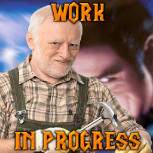

I can't work on the map efficiently since Reforged release. Currently, the map is just a collection of items and abilities for a "Custom Hero"-type map.

## In-game Commands

#### Statistic Board

A multiboard that contains information about players' damage done and kills

Command | Short | Purpose
--- | --- | ---
-ResetStatistic | -rs | sets the statistic board's values to zero
-ShowTotalStatistic | -sts | shows statistic for the whole game

### Test Commands

The commands below can be used in singleplayer mode to test the map. Non-case sensitive.

#### Base Restoration

Command | Short | Purpose
--- | --- | ---
-DisableBaseRestoration | -dbr | disables health and mana restoration at the base
-EnableBaseRestoration | -ebr | enables health and mana restoration at the base

#### Test Ghoul

Creates N enemy ghouls in TestGhoul rect that can be used to test abilities and items. 

Command | Short | Purpose
--- | --- | ---
-CreateTestGhoul N | -ctg N | creates N enemy ghouls (N can be ommited)
-RemoveTestGhouls | -rtg | kills all created ghouls
-SetTestGhoulHitPoints N | -stghp N | sets ghouls' amount of hit points to N

#### Damage Info

Can be used in multiplayer.

Command | Short | Purpose
--- | --- | ---
-ShowDamageInfo | -sdi | the player will receive messages about dealing and taken damage
-HideDamageInfo | -hdi | the player won't receive messages about dealing and taken damage

#### Heroes

Command | Short | Purpose
--- | --- | ---
-CreateAllCustomHeroes | -cach | adds all built custom heroes on the map
-CreateCustomHero N | -cch N | adds a built hero on the map by name N (not proper name) (non-case sensitive)
-RemoveCustomHeroes | -rch | removes all the added heroes from the map